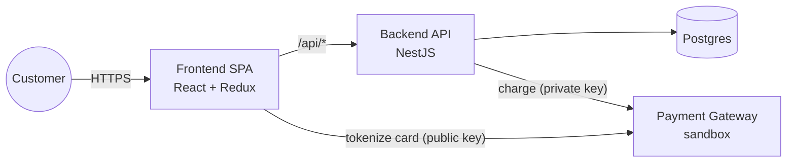

# ARD — Architecture Requirements Document

Bridges the functional requirements in [PRD.md](PRD.md) into a concrete architecture
blueprint. The *why* behind each decision lives in
[decisions/0001-architecture-overview.md](decisions/0001-architecture-overview.md);
this document describes the resulting architecture in enough detail to drive the
per-app specs (`backend/specs`, `frontend/specs`, `infra/specs`).

## System context



The card's PAN/CVC path is `Customer → FE → Gateway` only. It never touches `BE` or
`DB` (see ADR 0001, "Card data security").

## Backend architecture (hexagonal, Ports & Adapters)

Ports are split by direction, as in "textbook" hexagonal architecture:

| Layer | Contains | Depends on |
|---|---|---|
| `domain` | Entities (`Product`, `Transaction`, `Customer`, `Delivery`, `Payment`), value objects (`Money`), domain errors (`OutOfStock`, `PaymentDeclined`, `GatewayError`, `InvalidTransition`...), the `Transaction.transitionTo` state machine | Nothing (pure TS) |
| `ports/inbound` | One driving interface per **resource**, not per use case: `TransactionsPort` (`create(cmd)`, `getById(id)`), `ProductsPort` (`getCurrent()`). What the outside world is allowed to ask the application to do | `domain` types only |
| `ports/outbound` | Driven interfaces the application needs from the outside world: `ProductRepository`, `TransactionRepository` (its `findByIdWithDetails` joins customer/delivery/payment in one read — see below), `PaymentGatewayPort` | `domain` types only |
| `application` | One service class per resource implementing its `ports/inbound` interface (`TransactionsService implements TransactionsPort`, `ProductsService implements ProductsPort`). Each method is a single ROP chain (`neverthrow`) against `ports/outbound` — the method *is* the use case, no separate use-case class per method | `domain`, `ports` (interfaces only) |
| `infrastructure` | Outbound adapters implementing `ports/outbound`: ORM repositories (Postgres), `HttpPaymentGatewayAdapter` (axios, wraps calls with `ResultAsync.fromPromise` to turn exceptions into `GatewayError`) | `ports/outbound`, external libs |
| `interface` | Inbound adapter: NestJS controllers + DTOs (`class-validator`), one controller per resource, depending on that resource's `ports/inbound` interface (injected by token, not the concrete service class). Only job: call the port, then an exhaustive `switch` on the `Result`'s error type → HTTP status (see ADR 0001's mapping table) | `ports/inbound` |

`customers`, `deliveries` and `payments` don't get their own outbound repository —
they're only ever written as part of `TransactionRepository.createPending`/
`updateResult`, and only ever read together, alongside the transaction, for
`GET /transactions/:id`. Giving each its own repository port would mean the
application layer re-assembling them with N extra round trips to do what one SQL
join already does — real abstraction cost for no real benefit here, since nothing
in this app ever needs one of them in isolation. `TransactionRepository` owns the
join internally (Prisma `include`) and returns a composed `TransactionDetail`.

Suggested module layout (single bounded context is enough for this scope):

```
backend/src/
  checkout/
    domain/
    ports/
      inbound/
      outbound/
    application/
    infrastructure/
    interface/
  shared/        # Money, Result helpers, pino logger, Sentry bootstrap
```

`TransactionsService.create` is the central use case and mirrors the PRD's payment
confirmation flow: reserve stock → create customer + delivery + `PENDING`
transaction (atomic) → call `PaymentGatewayPort.charge` → update transaction +
`payments` row with the result → release the stock reservation if not `APPROVED`.
The transactions controller depends only on `TransactionsPort`; `TransactionsService`
depends only on `ports/outbound` (`TransactionRepository`, `PaymentGatewayPort`,
etc.) — the controller never sees the outbound ports, and the outbound adapters
never see the inbound one.

## Frontend architecture

**Redux** (`checkoutSlice`): `step` (1–5, only moves forward), `productSnapshot`,
`transactionId`, `reference`, `status`, `customerDraft`, `deliveryDraft`, `error`.
**Never** card number, CVC or `cardToken` — those live only in the payment form's
local component state and are discarded right after the tokenization call resolves,
matching ADR 0001's persistence whitelist.

Persistence: `redux-persist` (or an equivalent manual `localStorage` sync) with an
explicit whitelist limited to the fields above, so a refresh mid-checkout restores
`step` and the in-progress data without ever writing sensitive fields to disk.

Screens map 1:1 to the PRD's 5-step flow, each reading/dispatching against
`checkoutSlice`:

| Screen | Reads | Writes on success |
|---|---|---|
| 1. Product page | `GET /products/current` | `productSnapshot` |
| 2. Card/delivery modal | — | `customerDraft`, `deliveryDraft`, local `cardToken` |
| 3. Summary (backdrop) | `productSnapshot`, fees | `POST /transactions` → `transactionId`, `reference`, `status` |
| 4. Final status | `GET /transactions/:id` (poll if `PENDING`) | `status` |
| 5. Back to product page | `GET /products/current` (fresh stock) | resets `checkoutSlice` |

API layer: a thin typed client matching `API-CONTRACT.md` (`api/products.ts`,
`api/transactions.ts`), kept separate from the gateway tokenization client (calls the
gateway directly with the public key, per ADR 0001 — never proxied through our
backend).

## Cross-cutting concerns

- **Security**: OWASP response headers via the CloudFront headers policy (ADR 0001);
  all backend input validated at the `interface` layer with `class-validator` DTOs
  before it ever reaches a use case.
- **Observability**: pino structured logs with a correlation id per request
  (redacting `cardToken`, email, address); Sentry front + back with `beforeSend`
  filtering the same fields (ADR 0001).
- **Error handling**: `application` layer never throws for expected failures — it
  returns `Result`/`ResultAsync`. The `interface` layer's exhaustive switch is the
  single place mapping domain errors to HTTP status, so adding a new domain error
  that isn't handled there is a compile error, not a runtime surprise.
- **Testing**: `domain` and `application` are unit-tested with fake adapters
  implementing the ports — no HTTP/DB mocking needed for business logic.
  `infrastructure` adapters get narrower tests around the exception→`Result`
  conversion. Coverage gate: 80%, enforced in CI (ADR 0001).

## Traceability (PRD → architecture)

| PRD requirement | Where |
|---|---|
| Stock/transactions/customers/deliveries entities, "different types of requests" | `domain` entities + one repository port per entity (see [DATA-MODEL.md](DATA-MODEL.md)) |
| PAN/CVC never reach the backend | Card path stays `FE → Gateway`; backend only ever sees `cardToken` |
| Resiliency (refresh doesn't lose progress) | `checkoutSlice` + persistence whitelist |
| Out-of-stock / double-submit / concurrent buyers | Atomic stock reservation at transaction creation + `idempotencyKey` (ADR 0001) |
| >80% coverage front + back | CI `coverageThreshold` gate (ADR 0001) |
| Hexagonal + ROP (bonus) | Backend layering above |
