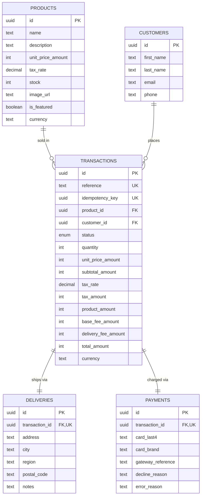

# Data Model

Covers the four required entities (`products`, `transactions`, `customers`,
`deliveries`) plus `payments` — a 1:1 split off `transactions` to keep the gateway
charge details (card display info, gateway reference, decline/error reason) separate
from the order/pricing facts — and the design decisions behind them. See
[decisions/0001-architecture-overview.md](decisions/0001-architecture-overview.md)
for the stock-reservation and transaction state machine rules this schema enforces.

## Diagram

## Tables

### `products`

Seeded with dummy data, no create endpoint. Multiple products can exist (the brief
requires seeding "dummy Products", plural) but the app only ever surfaces one:
`is_featured = true` marks the single product `GET /products/current` returns (see
[API-CONTRACT.md](API-CONTRACT.md)). Exactly one row should have `is_featured = true`
in the seed.

| Column | Type | Notes |
|---|---|---|
| `id` | uuid PK | |
| `name` | text | |
| `description` | text | |
| `unit_price_amount` | int | Price before tax. COP has no decimals |
| `tax_rate` | decimal | IVA rate as a fraction (`0.19`, `0.05`, `0.00`...) — varies per product, some categories in Colombia have a reduced or zero rate |
| `stock` | int | `CHECK (stock >= 0)` |
| `image_url` | text, nullable | |
| `is_featured` | boolean | Exactly one `true` row expected |
| `currency` | text | Always `"COP"` for this test |

### `customers`

Created together with the transaction at checkout time. No accounts, no auth (out of
scope per PRD), so there's no uniqueness constraint on `email` — a repeat buyer just
creates a new row. Acceptable because the app never looks customers up by identity.

| Column | Type | Notes |
|---|---|---|
| `id` | uuid PK | |
| `first_name` | text | |
| `last_name` | text | |
| `email` | text | |
| `phone` | text | |

### `deliveries`

One-to-one with a transaction: it's the shipping info for that specific order, not a
reusable address book entry.

| Column | Type | Notes |
|---|---|---|
| `id` | uuid PK | |
| `transaction_id` | uuid FK → `transactions.id`, unique | 1:1 |
| `address` | text | |
| `city` | text | |
| `region` | text, nullable | |
| `postal_code` | text, nullable | |
| `notes` | text, nullable | |

### `transactions`

Created as `PENDING` before the gateway is called, reserving stock atomically at that
point (see ADR 0001 — this is what prevents overselling the last unit(s), now
generalized to reserve `quantity` units instead of always 1). Money fields are
**snapshots** taken at creation time (unit price, quantity, tax rate/amount, base
fee, delivery fee), never recomputed later, so historical transactions stay accurate
even if a product's price/tax rate or the fee config changes afterwards.

| Column | Type | Notes |
|---|---|---|
| `id` | uuid PK | |
| `reference` | text, unique | Human-facing transaction number (e.g. `TRX-000123`) |
| `idempotency_key` | uuid, unique | Client-generated; guards double-submit |
| `product_id` | uuid FK → `products.id` | |
| `customer_id` | uuid FK → `customers.id` | |
| `status` | enum (`transaction_status`) | `PENDING \| APPROVED \| DECLINED \| ERROR \| VOIDED`, DB-level type |
| `quantity` | int | `CHECK (quantity >= 1)`. Units purchased, reserved atomically from `products.stock` |
| `unit_price_amount` | int | Snapshot of `products.unit_price_amount` (single unit) |
| `subtotal_amount` | int | `unit_price_amount * quantity`, before tax |
| `tax_rate` | decimal | Snapshot of `products.tax_rate` applied to this purchase |
| `tax_amount` | int | `subtotal_amount * tax_rate`, computed and stored at creation time |
| `product_amount` | int | `subtotal_amount + tax_amount` — the full product line, incl. IVA, across all units |
| `base_fee_amount` | int | Snapshot of the configured base fee |
| `delivery_fee_amount` | int | Snapshot of the configured delivery fee |
| `total_amount` | int | Sum of the three amounts above, stored for cheap querying |
| `currency` | text | Always `"COP"` |

Status transitions are enforced at the DB level with a conditional update
(`WHERE status = 'PENDING'`), not just in application code — see ADR 0001's
"Transaction state machine" section.

### `payments`

One-to-one with a transaction: everything about the actual charge attempt against the
gateway, kept separate from the order/pricing facts on `transactions` so that table
doesn't grow with every payment-specific detail. Created alongside the transaction
(row exists even before the gateway responds; fields besides `card_last4`/`card_brand`
are filled in once a result comes back).

| Column | Type | Notes |
|---|---|---|
| `id` | uuid PK | |
| `transaction_id` | uuid FK → `transactions.id`, unique | 1:1 |
| `card_last4` | text, nullable | Last 4 digits only — never the PAN |
| `card_brand` | text, nullable | `VISA \| MASTERCARD \| UNKNOWN`, from tokenization response |
| `gateway_reference` | text, nullable | Charge id returned by the gateway |
| `decline_reason` | text, nullable | Set only when the transaction ends `DECLINED` (business outcome) |
| `error_reason` | text, nullable | Set only when the transaction ends `ERROR` (technical failure) |

## What's deliberately NOT modeled

- **Fee configuration table.** `base_fee_amount`/`delivery_fee_amount` come from env
  config (fixed, per the PRD), not a DB table — there's nothing to manage at runtime
  since there's no admin panel. Only the resulting snapshot is persisted, on the
  transaction.
- **Card data.** No PAN, CVC or expiry ever reach the backend or this schema — only
  the gateway's token (used once, not stored) and the non-sensitive `card_last4` /
  `card_brand` for display on the final status screen.
- **Delivery status/tracking.** The PRD only asks to "assign the product to be
  delivered"; there's no shipment tracking flow, so `deliveries` has no `status`
  column. The transaction's own status is what final-status screen renders.
